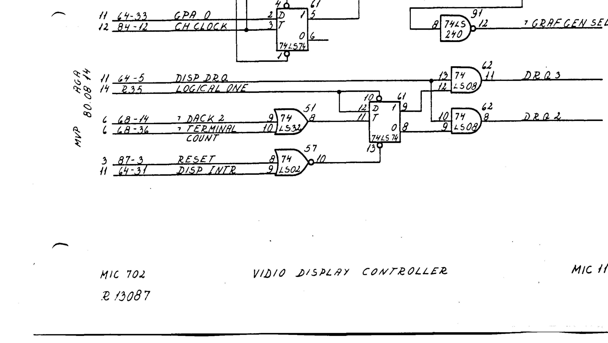

# DMA channel 3 — 8275 "roll" second channel (hardware-assisted scroll)

**Status:** unused by all current RC702/RC703 firmware (roa375, autoload-in-c, rcbios, cpnos-in-c, cpnos-in-asm).  All known software programs ch2 to cover the entire 80×25 visible region and treats ch3 as a no-op armed channel with word count = 0.  This document records the hardware capability so it can be used (or at least correctly programmed) in the future.

## TL;DR

The RC702/RC703 schematic wires *both* DMA channels 2 and 3 to the 8275 CRT controller, with external glue on schematic page MIC 11 (PDF index 81 in `RC702tech.pdf`) that routes the 8275's single `DSP DRQ` output to either `DRQ2` or `DRQ3` of the Am9517A-4 based on a D flip-flop.  At each vertical-retrace interrupt (VRTC) the flip-flop is cleared and **ch2 services first**; after **ch2 hits TC** the flip-flop toggles and **ch3 services the remainder of the frame**.  The next VRTC resets the flip-flop and the pattern repeats.

This is the hardware basis for **roll** (hardware-assisted vertical scroll): hold the display in a memory region larger than the visible window, split the visible 2000 bytes between ch2 (top region) and ch3 (bottom region, wraparound), and "scroll" by reprogramming ch2/ch3 word counts and base addresses — no memcpy of screen memory required.

## Manual citations

> "The display controller uses two channels out of the DMA's four channels.  **This is done to make the roll function of the display.**  DRQ2 and DRQ3 are the two data request signals." — RC702/RC703 Microcomputer Technical Manual (RCSL 44-RT2056, Feb 1983), `DRQ3 and DRQ2` signal description in MIC 11 reference (`docs/RC702tech.pdf` text-layer line 3887; same text duplicated in `docs/RC702-RC703_Microcomputer_technical_manual.pdf` lines 3370 and 5397).
>
> "DISP ACK — Display acknowledge.  The display controller uses two channels in the DMA." — same manual, `DACK 2 / DACK 3` signal description (`docs/RC702tech.pdf` line 3074-3076).
>
> Section 2.3.9 (DMA Controller): "channel 2 : Visual display controller / channel 3 : Visual display controller." (`docs/RC702tech.pdf` lines 1299-1303).

The prose statement of *intent* (roll) is unambiguous; the gate-level *mechanism* is on schematic page **MIC 11** (PDF index 81), reproduced in part as `docs/img/mic11_drq_gating.png` and traced below.

## Gate-level mechanism (MIC 11 bottom right)

The 8275 has only one DMA-request pin (`DSP DRQ`, pin 5 of the 8275 = chip 64).  Four discrete ICs distribute it to the 8237's two `DREQ` inputs:

| Chip | Type | Role |
|---|---|---|
| 74LS08 (chip 62) | Quad 2-input AND | Two gates used: one for DRQ2 = `DSP DRQ AND /Q`, one for DRQ3 = `DSP DRQ AND Q` — Q comes from the FF below |
| 74LS74 (chip 61) | Dual D flip-flop | Second FF used: D=`LOGICAL ONE` (pulled up via R35), CLK=output of 74LS32, /CLR=output of 74LS02, /PRE=`LOGICAL ONE` (never preset).  Q latches D=1 on rising CLK; /CLR forces Q=0 |
| 74LS32 (chip 51) | Quad 2-input OR | One gate used: inputs = `/DACK 2` (8237 pin 14, active low) + `/TERMINAL COUNT` (8237 pin 36, active low).  Output → 74LS74 CLK |
| 74LS02 (chip 57) | Quad 2-input NOR | One gate used: inputs = `RESET` + `DISP INTR` (the 8275's VRTC interrupt output, pin 31).  Output → 74LS74 /CLR — forces Q=0 whenever RESET *or* VRTC is asserted |

Active-low convention: signal names with a leading "7" prefix in the schematic (e.g. `7 DACK 2`, `7 TERMINAL COUNT`, `7 IORD`) are the document's overbar notation for negated/active-low signals.  8237 DACK polarity defaults to active-low after master clear (command register bit 7 = 0), which matches.

### Per-frame sequence

1. **VRTC fires** (start of vertical retrace).  `DISP INTR` asserted → 74LS02 NOR output = 0 → 74LS74 /CLR active → Q = 0, /Q = 1.
2. **ch2 is selected.**  Lower 74LS08: DRQ2 = `DSP DRQ AND /Q` = `DSP DRQ AND 1` = `DSP DRQ`.  Upper 74LS08: DRQ3 = `DSP DRQ AND Q` = `DSP DRQ AND 0` = 0.
3. **VRTC ends.**  `DISP INTR` deasserts → /CLR releases → FF latched at Q=0.
4. **8275 issues DRQs in bursts** (burst length per `START DISPLAY` command).  Each DRQ goes to DREQ2, ch2 services from its (autoinit-reloaded) base address, /DACK 2 pulses active-low per DMA cycle.  74LS32 OR output stays high during these cycles (`/DACK 2`=0 alone is not enough to drive OR low — needs both inputs low).
5. **ch2 hits Terminal Count** after (`ch2 wc` + 1) bytes.  At that point both `/DACK 2` and `/TERMINAL COUNT` go active-low simultaneously → 74LS32 OR output transitions HIGH → LOW.  When TC pulse ends, OR transitions LOW → HIGH (rising edge) → 74LS74 clocks D=1 into Q.
6. **ch3 is selected.**  Q = 1, /Q = 0.  DRQ2 path = 0 (blocked); DRQ3 path = `DSP DRQ`.
7. **8275 issues remaining DRQs.**  They route to DREQ3; ch3 services from its base address, up to (`ch3 wc` + 1) bytes (or until the 8275 stops requesting at frame end, whichever comes first).
8. **Next VRTC** clears the FF → back to step 2.

ch3's TC does *not* re-clock the FF, because by then ch3 is the active channel and `/DACK 2` stays high (inactive); the OR gate cannot transition.  The only path back to Q=0 within a frame is via `/CLR`, which is driven only by RESET and VRTC (`DISP INTR`).

## Implications for software

### Current state — all firmware ignores the capability

| Firmware | ch2 config | ch3 config | Effective behavior |
|---|---|---|---|
| roa375 (RC700 autoload PROM) | base = `0x7800`, wc = `0x07CF` (2000 bytes), mode `0x5A` (autoinit, mem→IO) | **never programmed** (mask register leaves it disabled) | ch2 covers full screen, ch3 never fires; harmless |
| autoload-in-c (clang autoload PROM, ROA375) | base = `0x7A00`, wc = `0x07CF`, mode `0x5A` | not programmed | same |
| rcbios | per `docs/RC702_BIOS_SPECIFICATION.md` §4.1: ISR re-masks both ch2+ch3, reloads ch2 base/wc, sets `ch3 wc = 0`, then unmasks both | armed but quiescent | ch2 covers full screen; ch3 enabled with wc=0 and base never written.  See "edge cases" below |
| cpnos-in-c | init.c programs ch2 mode `0x5A`, ch3 mode `0x5B`, ch2 base=`0xF800`/wc=`0x07CF`, ch3 wc=`0`, both unmasked.  ISR does *not* touch DMA (commit `9592c2d`) — autoinit reloads ch2 base/wc each frame | armed but quiescent | ch3 base register **never written** since master clear; whatever the AM9517A holds for ch3 base on reset is what would be used if a DRQ ever reached ch3 |

The current ch2 wc covers exactly the 2000-byte visible region.  The 8275 issues exactly 2000 DRQs per frame for an 80×25 display.  By the time `ch2 TC` fires (after byte 2000), the 8275 has no more DRQs to issue this frame.  The FF clocks to Q=1, ch3 is now selected, but **no DRQ ever reaches it before the next VRTC clears the FF**.  This is why none of the firmware produces visible garbage despite ch3 being in a half-defined state in cpnos.

### Hypothesis (user, 2026-06-14) — "wc=0 = immediate finish, switches back"

The conjecture was that `ch3 wc = 0` is a defensive "if anything dribbles to ch3, transfer 0 (or 1) bytes and bounce back to ch2".  The schematic shows the bounce-back path doesn't actually exist within a frame — only VRTC re-selects ch2 — but the practical effect is the same because the 8275 doesn't issue extra DRQs once the frame's worth is fetched.  So setting `ch3 wc = 0` is a working safety net even though the gate-level explanation is different from the mental model.

### Edge case worth fixing regardless

cpnos-in-c (and rcbios per the spec) leave ch3 unmasked with a never-written base register.  In normal operation the 8275 doesn't issue extras, so ch3 never fires.  But:

- If a future change extends the visible buffer (e.g. 26-line status, larger row count), ch2's wc no longer covers the whole frame and ch3 starts servicing — from an undefined base.
- If the 8275 ever issues an extra DRQ (e.g. during a display-mode change before its internal counters settle), ch3 services from undefined memory.
- Code-review readability: an unmasked channel with no base is a smell that costs a few cycles to puzzle out.

Two clean fixes, pick one:

1. **Fully mask ch3** post-init by writing `0x07` to `PORT_DMA_SMSK`.  Reverts the "armed safety net" but matches the actual usage (ch3 is never wanted).  Saves ~2 bytes of init table.
2. **Fully program ch3** with a known-safe base (e.g. same as ch2's base, so even a stray DRQ fetches a real char) and a small wc.  Keeps the safety net explicit.

Either is better than the current "half-armed" state.

### Future use — the roll function

To actually use the roll capability:

- Hold the display in a circular buffer larger than 2000 bytes (e.g. 32 rows × 80 = 2560 bytes, or 64 rows × 80 = 5120 bytes), aligned so the wrap point falls on a row boundary.
- Maintain a `top_row_offset` software pointer.
- Each VRTC, reprogram (under DMA-mask bracket):
  - `ch2 base = buffer + top_row_offset`,  `ch2 wc = bytes_until_wrap - 1`
  - `ch3 base = buffer`,  `ch3 wc = (2000 - bytes_until_wrap) - 1`
- Scroll-up = `top_row_offset += 80`; clear the new bottom row in-place.  Zero memcpy.

Caveats:
- 8237 autoinit reloads from the **base** registers on TC.  Reprogramming the base on every frame means autoinit is mostly redundant; either keep autoinit on (and accept the redundant reload) or switch to non-autoinit (mode `0x4A`/`0x4B`) and reprogram explicitly.
- The DMA reload must complete before the 8275 starts fetching the next frame.  VRTC interrupt gives ~3 retrace rows of slack at 50 Hz.
- This was the whole point of stripping the per-VRTC DMA reload in cpnos (`9592c2d`) — to give a `DI`-bracket headroom for INIR.  Adding roll-mode reprogramming would put the per-VRTC work back; ROI of roll vs. headroom for INIR must be weighed.

## Where to use it (if ever)

Likeliest payoff for rcbios console: line-scroll currently does an 1920-byte memcpy when the cursor advances past row 24.  At Z80 4 MHz with `LDIR` that's ~9 ms of CPU stall per scrolled row (24 t-states × 1920 bytes / 4 MHz).  Roll-mode replaces it with a few stores to DMA registers (sub-millisecond).  Worth ~200 lines of carefully-written code; not worth doing speculatively, but the option exists if BIOS scroll latency becomes a finishing-checklist item (cf. `tasks/memory/project_finishing_firmware_components.md`).

cpnos is parked behind hardware (Steps 2+4) and doesn't need the feature.

## MAME modeling

The ravn/mame fork's `src/mame/regnecentralen/rc702.cpp` driver models the schematic wiring as of 2026-06-14:

| Schematic component | MAME wiring |
|---|---|
| 74LS74 D-FF | `TTL7474` device named `m_7474` |
| D input (LOGICAL ONE) | `m_7474->d_w(1)` in `machine_reset()` (defaults to 1 anyway) |
| /PRE input | `m_7474->preset_w(1)` in `machine_reset()` (never preset) |
| /CLR input (NOR(RESET, DISP INTR)) | `crtc.irq_wr_callback().set(m_7474, FUNC(ttl7474_device::clear_w)).invert()` — only DISP INTR wired; RESET is handled implicitly by MAME's device reset |
| CLK input (OR(/DACK2, /TC)) | `eop_w()` and `dack2_w()` both call `m_7474->clock_w(m_dack2 \|\| m_eop)` — modeling the 74LS32 OR gate output as the disjunction of the two real-line voltages |
| 74LS08 ch2 gate (`DRQ2 = DSP DRQ AND /Q`) | `qbar_w()` + `crtc_drq_w()`: `m_dma->dreq2_w(m_qbar_state && m_drq_state)` |
| 74LS08 ch3 gate (`DRQ3 = DSP DRQ AND Q`) | `q_w()` + `crtc_drq_w()`: `m_dma->dreq3_w(m_q_state && m_drq_state)` |

Before this change MAME had the 74LS74's structural wiring (gates, clear path) but the CLOCK input was unconnected, so Q stayed at 0 forever and ch3 was effectively dead in emulation.  After the change, firmware that sets `ch2 wc < 2000` triggers the schematic-accurate switch to ch3 at the right point in the frame.  Firmware that uses `ch2 wc = 0x07CF` (today's reality across all firmware) is byte-identical to the prior emulation, because the FF only clocks at frame-end and ch3 sees no DRQ.

## Open questions

The schematic shows `DISP INTR` (8275 IRQ output, pin 31) as the `/CLR` source — but `DISP INTR` is the VRTC interrupt that the CPU is *also* meant to service.  Is the FF clear tied to the 8275's internal VRTC pulse, or to the latched interrupt that stays asserted until CPU acknowledges it?  If the latter, the FF stays cleared (Q=0, ch2 selected) until the CPU reads the 8275 status register to ack — which means the timing of the ISR's `IN A,(0x01)` ack matters.  This is worth scope-tracing on real hardware before committing to a roll-mode design.  MAME's i8275 IRQ semantics (clear-on-status-read) align with the second interpretation.

## Corrections to existing docs

- `docs/RC702_BIOS_SPECIFICATION.md:156` labels ch3 as "display attributes".  That's the textbook 8275 transparent-attribute-mode role, but the RC702 8275 init uses `F=1` (non-transparent visible attributes, e.g. PARAM4 = `0x6D` in cpnos and `0x4D` in rob358) which does *not* use a second DMA channel for attributes.  The actual role of ch3 on this board is the roll-function second channel, per MIC 11.  Update the label and add a cross-reference to this document.
- `RC702_HARDWARE_TECHNICAL_REFERENCE.md` line 308 ("Channel 3: Intel 8275 display controller (second DMA channel)") is correct in fact but does not explain *what* the second channel is for.  Add a one-line "(roll function — currently unused; see `docs/dma_ch3_8275_roll_function.md`)".

## Cross-references

- `[[project_finishing_firmware_components]]` — strategic frame for whether to ever ship a roll-mode rcbios.
- `tasks/session-2026-06-14-windowed-trace-analysis.md` — context for why the per-VRTC DMA reload was stripped from cpnos.
- Commit `9592c2d` (rc700-gensmedet/cpnos-in-c) — the strip, which is what made cpnos's autoinit DMA work without ISR involvement.
